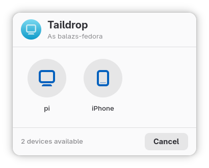
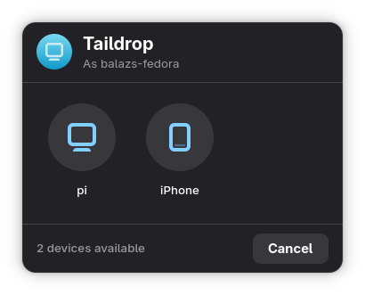

# nautilus-taildrop

A lightweight Tailscale Taildrop integration for GNOME's file manager. Send files to any device on your Tailnet from the file manager's Scripts menu, and automatically receive incoming files with a desktop notification.

## Preview



## Features

- **Right-click → Scripts → Send via Taildrop** (available in Nautilus and other GTK file managers)
- Native GTK4/libadwaita device picker UI
- Background auto-receive daemon that saves files to `~/Downloads`
- Desktop notification with an "Open" action when a file arrives
- Runs as a systemd user service — starts automatically on login

## Preview

Right-clicking a file and choosing the file manager's Scripts menu entry **Send via Taildrop** opens a small window listing all online Tailnet peers. Select a device and the file is sent immediately.

## Requirements

- Fedora / GNOME (also works on other distros with Nautilus or Nemo)
- [Tailscale](https://tailscale.com/download) installed and logged in
- `python3-gobject` (PyGObject) for the GTK4 UI

### Install dependencies on Fedora

```bash
sudo dnf install python3-gobject
```

### Install dependencies on Ubuntu/Debian

```bash
sudo apt install python3-gi gir1.2-gtk-4.0
```

## Installation

```bash
git clone https://github.com/YOUR_USERNAME/nautilus-taildrop.git
cd nautilus-taildrop
bash install.sh
```

The installer will:
1. Copy the scripts to `~/.local/bin` and `~/.local/share/nautilus/`
2. Enable and start the `taildrop-auto-receive` systemd user service
3. Restart the file manager (or log out / back in) so the Scripts menu is refreshed

## Uninstallation

```bash
bash uninstall.sh
```

## File Overview

| File | Purpose |
|---|---|
| `install.sh` | One-command installer |
| `uninstall.sh` | Removes all installed files and disables the service |
| `taildrop-auto-receive.sh` | Daemon script — waits for incoming Taildrop files and sends a notification |
| `taildrop-auto-receive.service` | systemd user unit that runs the daemon on login |
| `send-via-taildrop.py` | GTK4 UI — lists Tailnet peers and sends the selected files |

## How It Works

**Sending:** The installer places `send-via-taildrop.py` into the file manager's Scripts folder. Triggering the `Send via Taildrop` script launches `send-via-taildrop.py` with the selected file paths as arguments. The GTK4 window queries `tailscale status --json` to list online devices. Selecting a device runs `tailscale file cp <file> <device>:` in a background thread.

**Receiving:** The systemd service runs `taildrop-auto-receive.sh` as a persistent daemon. It calls `tailscale file get --wait` in a loop, which blocks until a file arrives. On success it sends a desktop notification via `notify-send`. Clicking "Open" on the notification opens the file with the default application.

## Troubleshooting

**The Scripts menu entry doesn't appear**

Log out and back in or restart your file manager to refresh the Scripts menu. In Nautilus or GNOME Files you can quit and restart it:
```bash
nautilus -q
```

**The service is not running**

```bash
systemctl --user status taildrop-auto-receive.service
journalctl --user -u taildrop-auto-receive.service -f
```

**Tailscale permission error when receiving files**

Make sure Taildrop is enabled for your device in the [Tailscale admin console](https://login.tailscale.com/admin/machines).

## License

MIT
