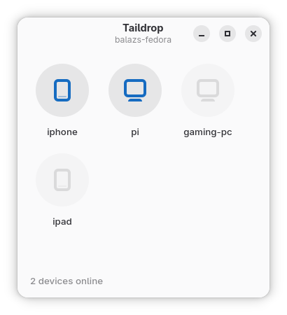
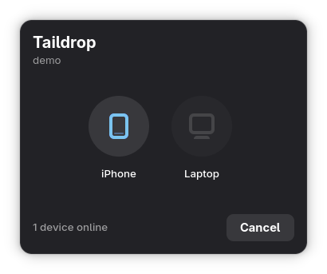

# Nautilus Taildrop

A lightweight Tailscale Taildrop integration for GNOME's Nautilus file manager






## 📋 Features

- **Nautilus Integration:** Right-click a file $\rightarrow$ `Send via Taildrop` (a native `nautilus-python` context-menu extension — no per-user setup).
- **Modern UI:** Borderless GTK4/Libadwaita device picker matching GNOME's design language and dynamic accent color.
- **Auto-Receive Daemon:** Background systemd user service that automatically saves incoming files to `~/Downloads`.
- **Desktop Notifications:** Native alerts with an immediate "Open" action upon receiving a file.

## 💻 Requirements

- Fedora / Ubuntu / Debian / Arch with Nautilus or Nemo
- Active [Tailscale](https://tailscale.com) installation and logged in on this device
- `tailscale` CLI available in `PATH`
- Python 3 with GObject introspection bindings
- `nautilus-python` (the Python extension loader) for the right-click menu entry

### Install Dependencies

**Fedora:**
```bash
sudo dnf install python3-gobject nautilus-python
```

**Ubuntu / Debian:**

```bash
sudo apt install python3-gi gir1.2-gtk-4.0 gir1.2-adw-1 python3-nautilus
```

**Arch:**

```bash
sudo pacman -S python-gobject nautilus-python
```

> The `tailscale` CLI must also be installed and authenticated separately. See https://tailscale.com/download for platform-specific instructions.

## 🔨 Installation & Setup

```bash
git clone https://github.com/PaarthShah/Nautilus-Taildrop.git
cd Nautilus-Taildrop
bash install.sh
```

### Arch Linux

Install straight from this repository with [`yay`](https://github.com/Jguer/yay) —
clone it and point `yay -B` at the bundled PKGBUILD directory (`yay -B` builds and
installs a local PKGBUILD; the PKGBUILD fetches the sources from this GitHub repo):

```bash
git clone https://github.com/PaarthShah/Nautilus-Taildrop.git
yay -B Nautilus-Taildrop/packaging/aur
```

Or without an AUR helper, using `makepkg` directly:

```bash
cd Nautilus-Taildrop/packaging/aur
makepkg -si
```

Once published to the AUR you'll also be able to `yay -S nautilus-taildrop-git`.

The package installs everything system-wide: the right-click entry comes from a
`nautilus-python` extension in `/usr/share/nautilus-python/extensions/`, and the
auto-receive **user** service is enabled via a `default.target.wants` symlink.
After installing, restart your file manager (`nautilus -q`) to load the extension;
the daemon starts on your next login (or run
`systemctl --user start taildrop-auto-receive.service` now).

> Publishing to the AUR requires the maintainer's SSH key:
> `git clone ssh://aur@aur.archlinux.org/nautilus-taildrop-git.git`, copy in
> `PKGBUILD` and `.SRCINFO` from `packaging/aur/`, then commit and push.

## 🧑‍💻 Development

The project uses [uv](https://docs.astral.sh/uv/) to manage dev tooling.

```bash
uv sync              # create the dev venv (ruff, pytest, PyGObject)
uv run ruff check .  # lint
uv run pytest        # run tests
```

`uv sync` builds PyGObject from source so the test suite can import the GTK module,
which needs the GObject-introspection and cairo development files plus a C compiler
(Arch: `sudo pacman -S glib2 cairo pkgconf base-devel`). The GTK/Adw typelibs are
still loaded from the system at runtime. The one widget-construction test
additionally needs a display and is skipped automatically when headless.

> The **application's** runtime stack (GTK4, libadwaita, the `tailscale` CLI, the
> typelibs) always comes from your distro, which is why `[project].dependencies` is
> empty — see the requirements above.

## 📂 Project Structure

* `send-via-taildrop.py` — The standalone GTK4/Libadwaita device selection window.
* `nautilus-taildrop.py` — The Nautilus/Nemo context-menu extension (via `nautilus-python`).
* `taildrop-auto-receive.sh` — The background loop utilizing `tailscale file get --wait`.
* `taildrop-auto-receive.service` — Systemd user service managing the auto-receive lifecycle.
* `pyproject.toml` — Project metadata, uv dev dependency group, and ruff lint config.

## License

Copyright (C) 2026 Balazs Miskey

This project is licensed under the GNU General Public License v3.0 - see the [LICENSE](LICENSE) file for details.
